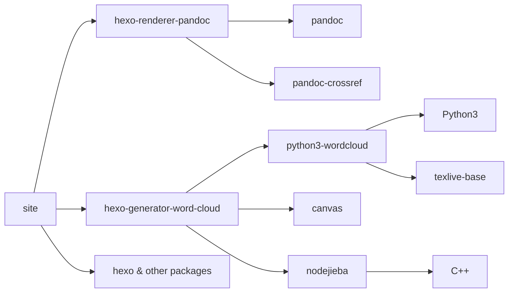

# Cerallin的笔记网站

**在线地址：** https://cerallin.github.io/notes

基于 [Hexo](https://hexo.io/) 的静态博客，托管于 GitHub Pages。
主题是我自己写的[hexo-theme-yuzu](https://github.com/cerallin/hexo-theme-yuzu) 

## 核心插件

- hexo-renderer-pandoc
- hexo-filter-text-autospace
- hexo-generator-word-cloud

## 目录和配置文件

| 目录                         | 作用                                                           |
| ---------------------------- | -------------------------------------------------------------- |
| **`themes/hexo-theme-yuzu`** | 我的主题 ^_^                                                   |
| **`source/_bibs/`**          | 参考文献（BibTeX `.bib` 文件），供 Pandoc 引用与生成参考文献。 |
| **`source/_jieba/`**         | 词云插件用到的资源：jieba 分词词典、词云遮罩图等。             |

根目录下的 **`_config.yml`** 为 Hexo 主配置；**`_config.hexo-theme-yuzu.yml`** 为 yuzu 主题的站点级覆盖配置。

## 构建网站所需软件

- **Node.js**
  用于运行 Hexo 及 npm 依赖。
- **Python3**
  用于构建词云。
- **texlive**
  是词云的依赖，非常重，有时间得想办法去掉。
- **Pandoc**
  用于渲染 Markdown，需在系统 PATH 中能调用 `pandoc`。
- **pandoc-crossref**
  用于文中图表与公式的交叉引用（与 `_crossref.yml` 配置配合）。
- **Git**  
  用于克隆仓库、子模块，以及部署时推送到 `gh-pages`。

## 本项目的依赖

